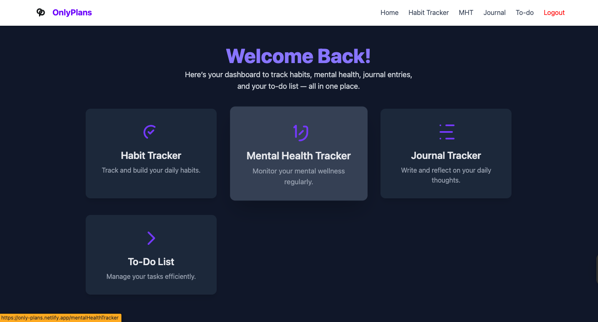
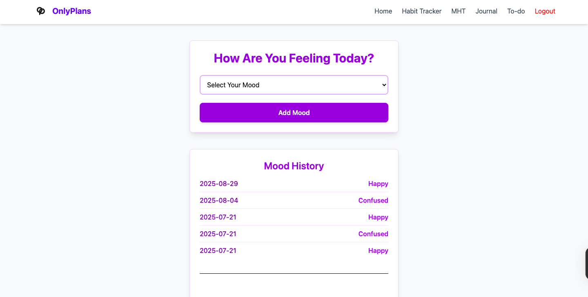
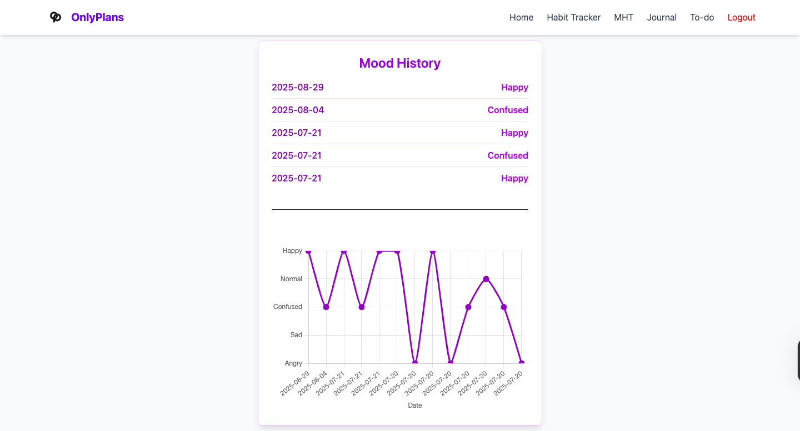
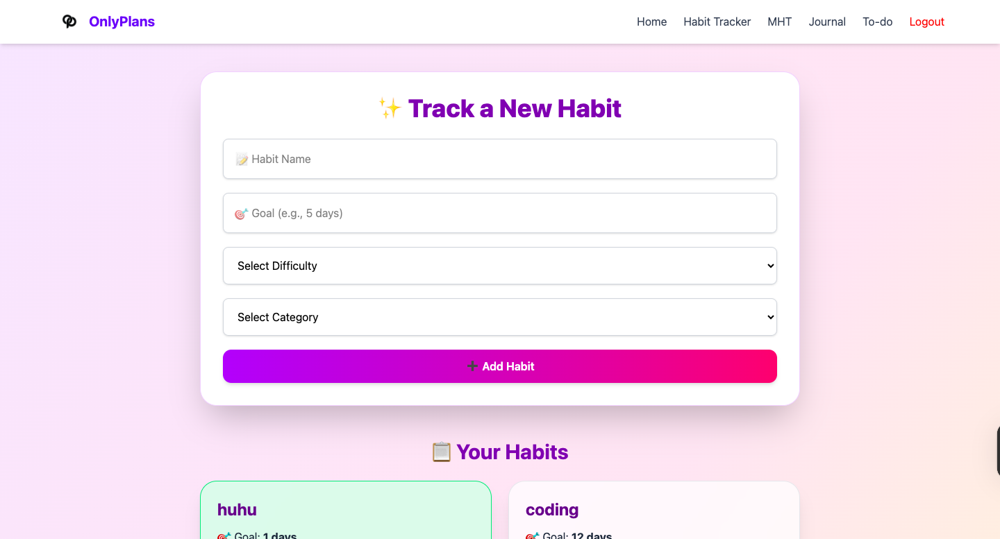
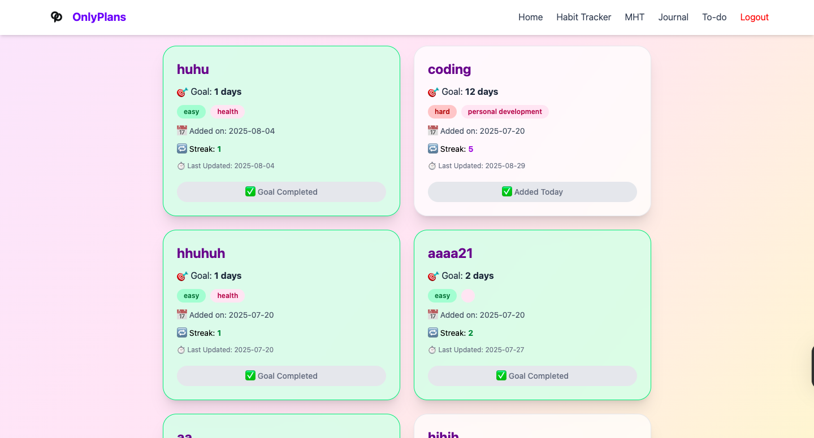
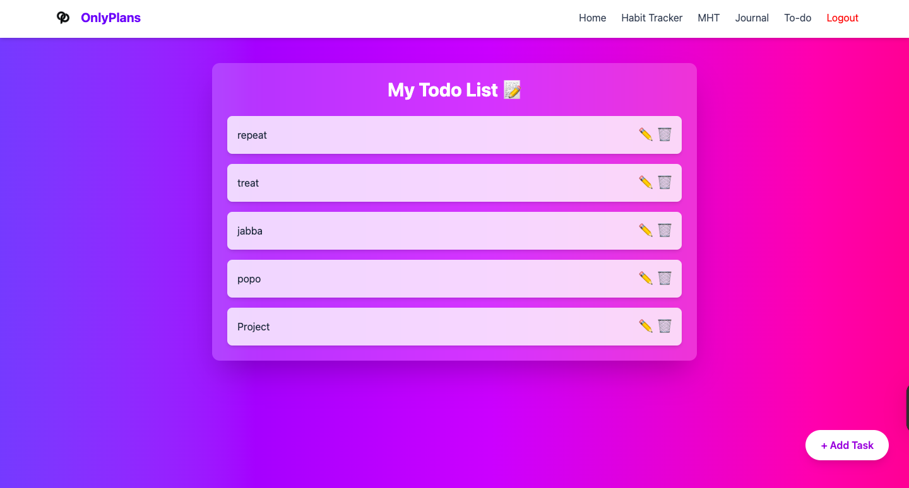

## 🧠 OnlyPlans – Your All-in-One Digital Planner

OnlyPlans is a comprehensive digital productivity and wellness platform built with React.js and Firebase. It combines a habit tracker, to-do list, daily journal, and a mental health tracker into one clean, responsive interface — helping users manage their routines and mental well-being seamlessly.

## 🚀 Features

    🧘 Mental Health Tracker – Reflect your mood daily and visualize trends with charts

    📓 Daily Journal – Log thoughts and activities with a rich-text journaling section

    ✅ To-Do List – Manage tasks with priority settings and drag and drop feature

    📈 Habit Tracker – Build and monitor positive habits over time

    📊 Visual Analytics – Chart.js-powered insights for mood, habit streaks, and progress

    🔐 Firebase Authentication – Secure signup/login using Firebase Auth

    ☁️ Cloud Storage – All user data is stored and synced in Firebase Realtime Database

    🎨 Responsive UI – Designed for both desktop and mobile users

    
## 🛠️ Tech Stack

    | Category               | Technologies                          |
    | ---------------------- | ------------------------------------- |
    | **Frontend**           | React.js, CSS (or Tailwind if used)   |
    | **Backend / Auth**     | Firebase Authentication & Realtime DB |
    | **Data Visualization** | Chart.js                              |
    | **Deployment**         | Netlify / Vercel (if applicable)      |

## 📸 Screenshots

### 🏠 Home / Dashboard

### 📓 Daily Journal

### 🧘 Mental Health Charts

### 📈 Habit Tracker

### ✅ To-Do List

## Live Link

    https://only-plans.netlify.app/

## Github
    
    https://github.com/shreyash139-eren/OnlyPlans-Project
